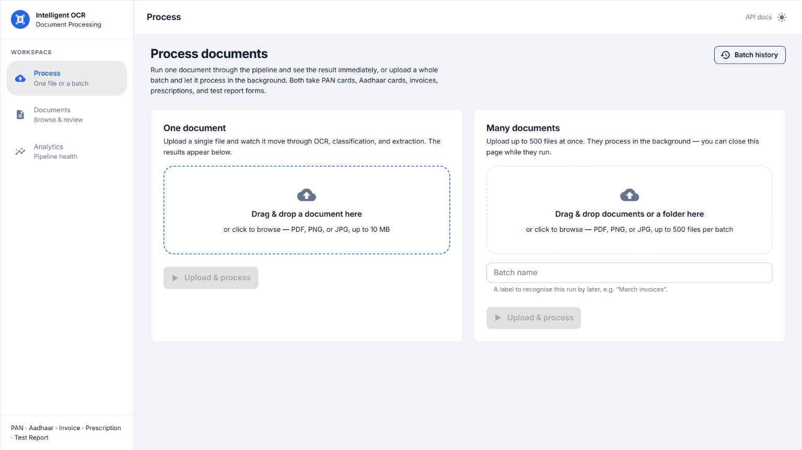
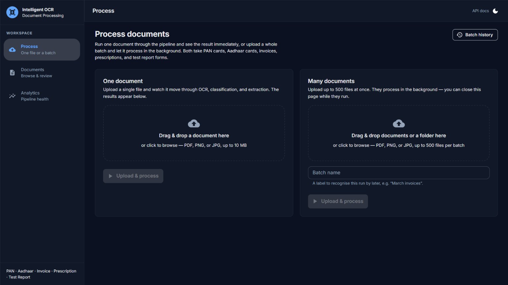
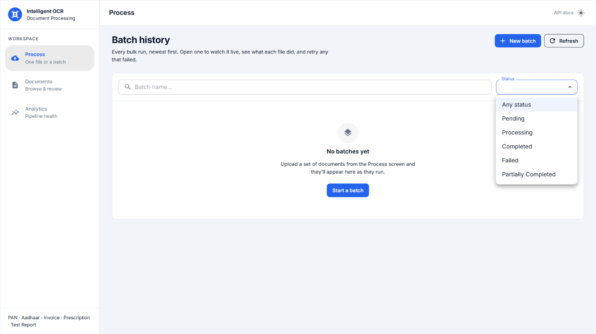
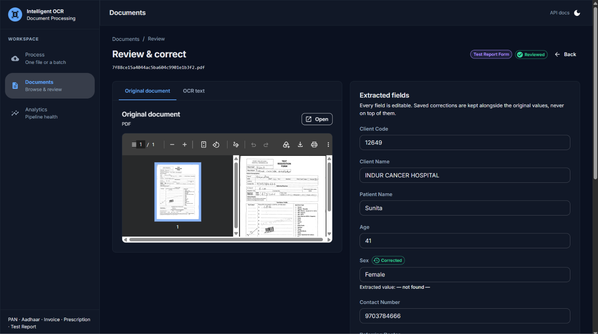
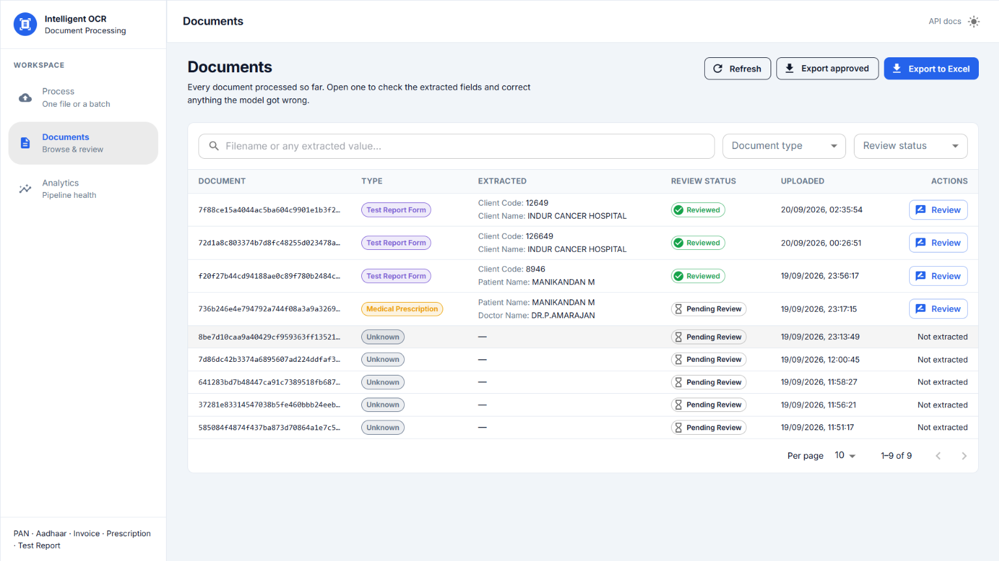
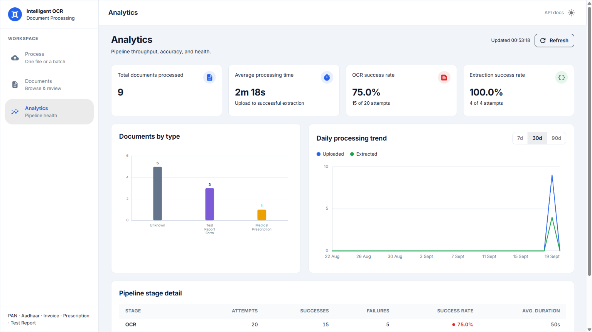

# Intelligent OCR Document Processing System

An end-to-end pipeline that turns a photographed or scanned document into
structured, human-verified data. Upload a PAN card, Aadhaar card, invoice,
medical prescription, or lab test report form; the system transcribes it
with OCR, classifies what kind of document it is, extracts the field set
defined for that type, lets a human correct anything the model got wrong,
and exports the whole inventory to Excel.

One document at a time, or **500 at once** — a batch upload returns
immediately and processes in the background on Celery workers, with live
progress, per-file error reporting, and retries.

Every step of that — every upload, OCR call, classification, extraction,
review, approval, batch, retry and export — is recorded in a searchable
**application log** with its own analytics dashboard and Excel export, so
"what happened to this document?" and "why is this batch stuck?" are
questions with answers rather than guesses.

Built as a FastAPI backend and a React frontend over Google Cloud's
Vertex AI (Gemini), with SQLite persistence and Redis as the task broker.
It runs entirely on a local Windows machine: no Docker, no cloud
deployment, no CI/CD.

---

## Table of contents

- [What it does](#what-it-does)
- [Screenshots](#screenshots)
- [How the pipeline works](#how-the-pipeline-works)
- [Tech stack](#tech-stack)
- [Project structure](#project-structure)
- [Prerequisites](#prerequisites)
- [Backend setup](#backend-setup)
- [Vertex AI credentials](#vertex-ai-credentials)
- [Redis setup (Memurai or WSL2)](#redis-setup-memurai-or-wsl2)
- [Running the whole system](#running-the-whole-system)
- [Frontend setup](#frontend-setup)
- [Configuration reference](#configuration-reference)
- [API reference](#api-reference)
- [Document types and extracted fields](#document-types-and-extracted-fields)
- [Data model](#data-model)
- [Human review workflow](#human-review-workflow)
- [The document viewer](#the-document-viewer)
- [Logging and the audit trail](#logging-and-the-audit-trail)
- [Excel export](#excel-export)
- [Batch processing](#batch-processing)
- [Analytics](#analytics)
- [Tests](#tests)
- [Error handling](#error-handling)
- [Troubleshooting](#troubleshooting)
- [Known gaps](#known-gaps)
- [Further reading](#further-reading)

---

## What it does

| Capability | Where it lives |
|---|---|
| Upload PDF / PNG / JPG with size and type validation | `POST /upload` |
| OCR via Gemini multimodal transcription | `POST /documents/{filename}/ocr` |
| Document-type classification (5 labels) | `POST /documents/{filename}/classify` |
| Structured field extraction per type | `POST /documents/{filename}/extract` |
| Human review with a full correction audit trail | `GET` / `PATCH /documents/{filename}/review` |
| In-page PDF/image viewer: zoom, fit-to-width, page navigation, download, value highlighting | `frontend/src/components/DocumentViewer.jsx` |
| Merged audit history — field changes *and* approve/reject actions | `GET /documents/{filename}/audit` |
| Bulk `.xlsx` export with filters | `GET /documents/export/xlsx` |
| Pipeline health and throughput metrics | `GET /analytics/summary`, `/analytics/daily-trend` |
| Browsable document records | `GET /documents`, `GET`/`DELETE /documents/{filename}` |
| Original scan/PDF shown beside the fields during review | `GET /documents/{filename}/file` |
| Batch upload of up to 500 files, processed in the background | `POST /batches/upload` |
| Live batch progress, retries, per-file outcomes | `GET /batches/{id}`, `/stream`, `POST /batches/{id}/retry` |
| Batch throughput and volume metrics | `GET /analytics/batches`, `/analytics/batch-volume` |
| Searchable, sortable, filterable application log | `GET /logs`, `GET /logs/{id}` |
| Log analytics: error trend, event distribution, processing-time trend | `GET /logs/analytics` |
| Excel export of all / filtered / error-only / date-ranged logs | `GET /logs/export/xlsx` |

---

## Screenshots

> **The seven image files are not in the repository yet.** The links below
> point at `docs/screenshots/`, which currently holds only a capture
> guide — see [`docs/screenshots/README.md`](docs/screenshots/README.md)
> for exactly what each shot should contain and what size to take it at.
> Drop the seven PNGs in with these names and this section renders;
> nothing else needs changing.

### Process — one document or a batch



Both ways of starting work sit side by side, because they are one
decision — "I have this one scan" or "I have this folder". The left
column runs a document through the pipeline and shows the result below;
the right column stages up to 500 files and hands them to a worker.

### Batch detail — live progress



Progress arrives over a Server-Sent Events stream, so the bar moves as
each file lands rather than on a refresh. The filled portion is split
into successes and failures, because "500 processed" and "497 processed,
3 failed" are entirely different outcomes. Failed files show the reason
and can be retried individually or all at once.

### Batch history



Every run, newest first, filterable by status and searchable by name.
Rows for running batches update on their own. `Partially Completed` is
its own status — the most common real outcome of bulk processing, and
the one that needs a person.

### Review — the original document beside the extracted fields



The source is on the left, the editable fields on the right. The left
pane tabs between the **original scan or PDF** and the **OCR text**; the
document is the default, because a field is ultimately right or wrong
against the paper, not against another machine output.

The document view is a real viewer, not an embedded browser frame: zoom,
fit-to-width, page navigation through a multi-page PDF, download, and —
where the page has a text layer — the extracted values **highlighted in
place on the page they came from**. See
[The document viewer](#the-document-viewer).

Corrections are stored alongside the model's answer, never on top of it,
and the **Audit history** panel interleaves every value that changed with
every approve/reject decision, newest first.

### Documents



Everything processed so far, with search across filenames and extracted
values, filters for type and review status, and one-click Excel export of
whatever is on screen.

### Analytics



Throughput, per-stage success rates, and a daily trend for documents —
plus batch success rate and daily volume once any batch has run. The
charts are hand-drawn SVG sharing the theme's colour tokens, so a
document type is the same colour in a chart, a badge, and a table row, in
both light and dark mode.

### Logs


Every recorded event, newest first, with free-text search, five filters,
sortable columns, server-side paging, and Excel export of exactly what is
on screen. The analytics panel above the table is collapsible, and each
of its five cards is a filter button — clicking "OCR failures" narrows
the table to the rows that number was counted from.

---

## How the pipeline works

```
   ┌────────┐     ┌──────┐     ┌──────────┐     ┌───────────┐     ┌────────┐
   │ Upload │ ──▶ │ OCR  │ ──▶ │ Classify │ ──▶ │  Extract  │ ──▶ │ Review │
   └────────┘     └──────┘     └──────────┘     └───────────┘     └────────┘
      file         Gemini       one of 5         type-specific      human
     to disk     transcribes    doc types        field schema     corrects
                 + stored
        │                            │                 │              │
        ▼                            ▼                 ▼              ▼
   Document row              document_type      extracted_data   reviewed_data
   (type=Unknown,             persisted           persisted     + field_corrections
    data=null)                                                    (audit trail)
```

### Two ways to drive it

Each stage is an independent HTTP endpoint, and **nothing in the backend
chains them** — which is what lets the same four stages be driven two
different ways:

- **Interactively**, one document at a time, by
  `src/hooks/useDocumentPipeline.js`. The browser calls each endpoint in
  turn, so the UI can light up each step as it completes and show the
  result the moment it exists.
- **In bulk**, by `services/document_pipeline.py`, which runs the whole
  sequence in one server-side call. That is what a Celery task executes,
  once per file. See [Batch processing](#batch-processing).

```
                        ┌─ interactive: 4 HTTP calls from the browser
   one document ────────┤
                        └─ batch: 1 Celery task per file, N files in flight
```

Both paths write to the same tables and feed the same analytics, so a
document is indistinguishable afterwards from how it arrived.

### When classification says `Unknown`

Classification can legitimately answer `Unknown` for a document that
isn't one of the five supported types, and there is no field schema for
`Unknown`, so extraction refuses it with a `422`. That is by design.

The interactive path handles it: the frontend shows
`UnsupportedDocumentPanel`, which offers the transcript and a selector to
extract *as* a chosen type, so a misclassified document is recoverable
without re-uploading. In a batch, the file is recorded as a success with
`document_type = Unknown` and no extracted data — it processed fine, it
simply isn't a type this system has fields for.

### OCR text is stored

`documents.ocr_text` holds the transcript, written by whichever stage
produced it (`crud.save_ocr_text`). The review screen reads it from
there, which is why a document processed days ago still shows its
transcript.

The *interactive* path still re-runs OCR per call — `/classify` OCRs
then classifies, `/extract` OCRs then extracts — so driving the pipeline
step by step costs up to three transcriptions of the same document. The
batch path does not: it OCRs once and passes the text down. See
[Known gaps](#known-gaps).

---

## Tech stack

**Backend**
- Python 3.11, FastAPI 0.115, Uvicorn
- SQLAlchemy 2.0 (typed `Mapped`/`mapped_column` style), SQLite (WAL mode)
- Pydantic 2 + pydantic-settings
- `google-genai` (Vertex AI / Gemini 2.5 Flash)
- Celery 5.4 + Redis, for background batch processing (threads pool on
  Windows — see `worker/celery_app.py`)
- pandas + openpyxl for the Excel export
- pypdf for PDF page counts

**Frontend**
- React 19, Vite 8
- Axios (single shared client instance)
- `EventSource` for live batch progress, with a polling fallback
- PDF.js (`pdfjs-dist`) for the in-page document viewer — dynamically
  imported, so it is downloaded only when a reviewer opens a PDF
- oxlint
- Hand-rolled SVG charts — no charting library

---

## Project structure

```
Intelligent OCR Document Processing System/
├── backend/
│   ├── app.py                      # FastAPI entrypoint: middleware, routers, exception handlers
│   ├── requirements.txt
│   ├── .env.example                # copy to .env and fill in
│   ├── api/
│   │   ├── router.py               # aggregates every route module
│   │   ├── processing_metrics.py   # times each pipeline stage into processing_events
│   │   └── routes/
│   │       ├── health.py           # GET /health
│   │       ├── upload.py           # POST /upload
│   │       ├── ocr.py              # POST /documents/{f}/ocr
│   │       ├── classification.py   # POST /documents/{f}/classify
│   │       ├── extraction.py       # POST /documents/{f}/extract
│   │       ├── review.py           # GET + PATCH /documents/{f}/review, GET /documents/{f}/audit
│   │       ├── export.py           # GET /documents/export/xlsx
│   │       ├── analytics.py        # GET /analytics/*
│   │       ├── logs.py             # GET /logs, /logs/filters, /logs/analytics, /logs/export/xlsx, /logs/{id}
│   │       ├── batches.py          # POST/GET/DELETE /batches/*, incl. the SSE stream
│   │       └── documents.py        # GET/DELETE document records
│   ├── core/                       # config, enums, exceptions, Vertex client (imports nothing above it)
│   │   ├── batch_status.py         # BatchStatus / BatchFileStatus enums
│   │   ├── log_events.py           # LogEventType / LogCategory / LogStatus + the event→category map
│   │   └── async_runner.py         # per-thread event loop, for the worker pools
│   ├── worker/                     # Celery
│   │   ├── celery_app.py           # broker/backend config + the Windows notes
│   │   └── tasks.py                # one task per file, plus the batch fan-out
│   ├── services/                   # business logic; no FastAPI, no DB sessions
│   │   ├── document_pipeline.py    # the shared OCR → classify → extract sequence
│   │   ├── batch_service.py        # staging a multi-file upload to disk
│   │   ├── batch_dispatch.py       # chooses Celery or the in-process fallback
│   │   ├── event_log.py            # the one write path for the application log
│   │   ├── batch_events.py         # the log rows a batch worker writes (shared by both executors)
│   │   ├── audit_service.py        # merges field corrections with review actions
│   │   ├── log_export_service.py   # streams the logs workbook
│   │   └── prompts/                # Vertex AI prompt + JSON schema definitions
│   ├── schemas/                    # Pydantic request/response contracts
│   ├── database/                   # engine, session, models, CRUD, analytics queries
│   │   ├── batch_crud.py           # claim/record/recompute — the concurrency-critical half
│   │   ├── batch_analytics.py      # batch throughput and volume queries
│   │   ├── log_crud.py             # log filtering, paging, export iteration, log analytics
│   │   └── app.db                  # SQLite file (git-ignored)
│   ├── tests/                      # pytest: batch API + CRUD, with the pipeline stubbed
│   ├── credentials/                # service account key goes here (git-ignored)
│   └── uploads/                    # stored files (git-ignored)
├── frontend/
│   ├── .env                        # VITE_API_BASE_URL
│   ├── vite.config.js              # + the plugin that serves PDF.js's WASM decoders and fonts
│   └── src/
│       ├── App.jsx                 # the route table, wrapped in the app shell
│       ├── api/                    # axios client + endpoint wrappers (documents, batches, analytics, logs)
│       ├── hooks/                  # useDocumentPipeline, useDocumentReview, useDocumentAudit,
│       │                           #   useAnalytics, useBatches, useBatchDetail, useBatchProgress (SSE),
│       │                           #   useLogs, useLogDetail, useLogAnalytics, useLogExport
│       ├── pages/                  # Upload, Documents, Review, Batches, BatchDetail, Analytics,
│       │                           #   Logs, LogDetail
│       ├── components/
│       │   ├── DocumentViewer.jsx  # the review screen's PDF/image viewer
│       │   ├── AuditHistory.jsx    # the merged audit panel
│       │   ├── viewer/             # PDF.js wiring, one-page renderer, highlight search
│       │   ├── logs/               # log chips, JSON block, the three log charts, analytics panel
│       │   ├── analytics/          # the document/batch charts and stat cards
│       │   └── batch/              # batch upload, progress, file table
│       └── utils/                  # formatting and label helpers
├── docs/
│   ├── architecture.md             # layering rules and design rationale
│   └── screenshots/                # the images in this README (see its own README)
└── README.md
```

### Layering rules

Dependency direction is strictly `api → services → database / core`.
Lower layers never import from higher ones:

- `core/` holds cross-cutting config and enums and imports from nothing else.
- `services/` takes plain data in and returns plain data out — no FastAPI
  imports, no `Session` arguments. This keeps business logic unit-testable
  without HTTP or a transaction. The one deliberate exception is
  `services/event_log.py` (and `batch_events.py` on top of it), where
  writing the row *is* the whole operation: a version that returned "the
  row you should write" for the route layer to persist would be a
  strictly more awkward way to spell the same thing, imposed at thirty
  call sites.
- `database/` owns persistence and translates driver errors into the
  app's own exception types.
- `api/` does HTTP concerns only: look things up, choose a status code,
  shape a response.

---

## Prerequisites

- **Python 3.11+**
- **Node.js 18+** and npm
- A **Google Cloud project** with the **Vertex AI API** enabled, and
  either a service account key or a `gcloud` login (see below)
- **Redis**, for batch processing — either [Memurai](#option-a-memurai-native-windows)
  (a native Windows service) or [Redis under WSL2](#option-b-redis-under-wsl2).
  Optional: without it, batches fall back to running inside the API
  process (see [Batch processing](#batch-processing)).

Billing must be active on the GCP project — Gemini calls are charged per
request.

---

## Backend setup

```bash
cd backend
python -m venv .venv
.venv\Scripts\activate           # Windows
# source .venv/bin/activate      # macOS / Linux
pip install -r requirements.txt
copy .env.example .env           # then fill in values
uvicorn app:app --reload
```

The server starts on `http://localhost:8000`.

| URL | What it is |
|---|---|
| `http://localhost:8000/api/v1/health` | Health check |
| `http://localhost:8000/docs` | Interactive Swagger UI |
| `http://localhost:8000/redoc` | ReDoc API reference |

On startup the app creates `backend/uploads/` if missing and runs
`init_db()`, which creates any missing tables and adds any mapped column
an existing table is missing (additive only — it is not a migration tool;
see `database/init_db.py`).

> **Run `uvicorn` from inside `backend/`.** Paths in `core/config.py`
> resolve against the `backend/` directory, but starting the server from
> elsewhere can still produce a second, empty `app.db` if you override
> `DATABASE_URL` with a relative path.

---

## Vertex AI credentials

OCR, classification, and field extraction all run on Vertex AI (Gemini).
Pick one of the two options below.

### Option A — service account key file (recommended for local setup)

1. In the GCP Console: **IAM & Admin → Service Accounts → Create**, grant
   it the **Vertex AI User** role, then **Keys → Add key → JSON**. A
   `credentials.json`-style file downloads.
2. Put that file at **`backend/credentials/gcp-service-account.json`**.
   That folder already exists and is git-ignored, so nothing you put
   there gets committed.
3. In `backend/.env`:
   ```
   GOOGLE_CLOUD_PROJECT=your-gcp-project-id
   GOOGLE_CLOUD_LOCATION=us-central1
   GOOGLE_APPLICATION_CREDENTIALS=credentials/gcp-service-account.json
   ```
   A relative path here resolves against `backend/`, not your current
   working directory (see `core/config.py`'s
   `google_application_credentials_path`).

### Option B — your own gcloud login (local dev only)

```bash
gcloud auth application-default login
```

Leave `GOOGLE_APPLICATION_CREDENTIALS` blank and set only
`GOOGLE_CLOUD_PROJECT`. Application Default Credentials picks up the
stored login automatically.

**Never commit a real key file.** `backend/.gitignore` already excludes
everything under `backend/credentials/` except the `.gitkeep` placeholder.
`core/vertex_client.py` builds one shared, lazily-created `genai.Client`
that all three AI services reuse.

---

## Redis setup (Memurai or WSL2)

Redis is the message broker between the API and the Celery workers that
process batches. Both supported options are local, and the application
cannot tell them apart: everything reads one setting,

```
REDIS_URL=redis://127.0.0.1:6379/0
```

and nothing in the codebase hardcodes a host or a port. Pick whichever
you prefer — switching later needs no code change and no config change.

### Option A: Memurai (native Windows)

Memurai is a Redis-compatible server that installs as a normal Windows
service, so it starts with the machine and needs no Linux layer.

1. Install Memurai Developer Edition from <https://www.memurai.com/get-memurai>.
2. The installer registers and starts a service listening on
   `127.0.0.1:6379`. Confirm it:

```powershell
Get-Service Memurai
memurai-cli ping     # -> PONG
```

Managing the service:

```powershell
Start-Service Memurai
Stop-Service Memurai
Restart-Service Memurai
```

### Option B: Redis under WSL2

1. Install WSL2 and a distro, if you don't already have one:

```powershell
wsl --install -d Ubuntu
```

2. Inside the WSL shell, install and start Redis:

```bash
sudo apt update
sudo apt install redis-server
sudo service redis-server start
redis-cli ping       # -> PONG
```

WSL2 forwards `localhost` from Windows into the distro, so the same
`redis://127.0.0.1:6379/0` reaches it from the Windows-side backend with
no extra configuration.

> WSL2's Redis does **not** start automatically after a reboot. Run
> `wsl sudo service redis-server start` (from PowerShell) when you next
> start work, or enable it inside the distro.

### Checking which one the app is using

The broker is probed per upload, so starting Redis after the API is
already running is fine — the next batch picks it up. Each batch records
which executor took it, visible on the batch list as a **Worker** or
**In-process** chip, and in the API as `executor` on the batch.

---

## Running the whole system

Four processes, each in its own terminal. Only the first two are needed
to use the app at all; the worker is what makes batch processing run
outside the API process.

**1. Redis** — Memurai runs as a service already, so there is nothing to
start. For WSL2:

```powershell
wsl sudo service redis-server start
```

**2. Backend** (from `backend/`, with the virtualenv active):

```powershell
uvicorn app:app --reload
```

**3. Celery worker** (from `backend/`, with the virtualenv active):

```powershell
celery -A worker.celery_app worker --pool=threads --concurrency=4 --loglevel=info
```

> **`--pool=threads` is required on Windows.** Celery's default `prefork`
> pool needs `fork()`, which Windows does not have; a prefork worker
> either refuses to start or fails on the first task deep inside
> billiard. The threads pool is also the right choice on its merits here
> — every pipeline stage is a network call to Vertex AI, so the GIL is
> released for the duration and threads give real parallelism. See the
> long note at the top of `backend/worker/celery_app.py`.
>
> `--pool=solo` also works and runs one file at a time; with it,
> concurrency means starting several worker processes.

**4. Frontend** (from `frontend/`):

```powershell
npm run dev
```

Then open <http://localhost:5173>.

### Celery Beat

Not needed. Nothing in this system is scheduled — batch work is queued
by the API in response to an upload or a retry, never on a timer. If you
add a periodic task later, Beat starts with:

```powershell
celery -A worker.celery_app beat --loglevel=info
```

### Verifying the worker is connected

```powershell
celery -A worker.celery_app inspect ping
```

A healthy worker replies `pong`. If it reports no nodes, the worker
isn't running or is pointed at a different `REDIS_URL`.

---

## Frontend setup

```bash
cd frontend
npm install
npm run dev
```

Opens at `http://localhost:5173`, which is already in the backend's
default `CORS_ORIGINS`. The backend must be running — there is no mock
mode.

`frontend/.env` holds a single variable:

```
VITE_API_BASE_URL=http://localhost:8000/api/v1
```

Only variables prefixed with `VITE_` are exposed to browser code. If the
file is missing, `src/api/client.js` falls back to that same default.

| Script | What it does |
|---|---|
| `npm run dev` | Vite dev server with HMR |
| `npm run build` | Production build into `dist/` |
| `npm run preview` | Serve the built `dist/` locally |
| `npm run lint` | oxlint |

### Using the app

1. **Process** tab — two ways to start work, side by side.

   *On the left, one document:* choose a PDF/PNG/JPG and upload. A
   progress bar tracks real bytes sent, then the pipeline steps light up
   as OCR, classification, and extraction run, and the results appear
   full width underneath.

   *On the right, a batch:* drag in many files (or a whole folder), name
   the run, and upload. You land on that batch's page, where progress
   streams live — and you can close it, because the files keep
   processing. Failed files are listed with the reason and can be
   retried individually or all at once. **Batch history** (top right)
   lists every run.
2. Results show the detected type, a confidence score, the raw OCR text,
   and the extracted fields.
3. Click **Review & correct fields** to open the review screen. The
   original scan or PDF sits on the left (with the OCR text one tab
   away) and every extracted field is editable on the right.

   The viewer's toolbar gives you page navigation, zoom, fit-to-width,
   a download of the original file, and a highlight toggle that marks
   the extracted values on the page they came from. Corrections are
   stored alongside the model's original values — never on top of them
   — and **Audit history** shows every change and every decision,
   newest first. **Approve** or **Reject** records a verdict on the
   whole document.
4. **Documents** tab — everything processed so far, whenever it was
   processed. Search across filenames and extracted values, filter by
   type and review status, open any document for review, and export what
   you are looking at (or just the approved set) to Excel.
5. **Analytics** tab — totals, per-type breakdown, per-stage success
   rates, a daily trend chart, and — once any batch has run — batch
   throughput, success rate, and daily batch volume.
6. **Logs** tab — every event the platform has recorded, newest first.
   Search the message, filename or batch id; filter by category, event
   type, status, document type and date range; sort any indexed column;
   and export exactly what you are looking at to Excel. **Analytics**
   (top right) opens the dashboard above the table, where each card
   doubles as a filter. Any row opens a detail page with the full JSON
   payload and links to the document and batch it was about.

   You can collapse the sidebar to an icon rail at any time with the
   button at the top left; the choice is remembered in the browser.

---

## Configuration reference

All backend settings live in `backend/.env` and are read once through
`core/config.py`. Nothing else in the app touches `os.environ`.

| Variable | Default | Purpose |
|---|---|---|
| `APP_NAME` | `OCR Document Processing System` | Shown in health check and OpenAPI title |
| `APP_VERSION` | `0.1.0` | Reported by `/health` |
| `ENVIRONMENT` | `development` | Free-form label |
| `DEBUG` | `true` | Enables SQL echo and DEBUG-level logging |
| `API_V1_PREFIX` | `/api/v1` | Prefix every route is mounted under |
| `CORS_ORIGINS` | `http://localhost:5173,http://localhost:3000` | Comma-separated allowed origins |
| `DATABASE_URL` | `sqlite:///<backend>/database/app.db` | SQLAlchemy connection string |
| `UPLOAD_DIR` | `<backend>/uploads` | Where uploaded files are stored |
| `MAX_UPLOAD_SIZE_MB` | `10` | Rejects larger uploads with `413` |
| `REDIS_URL` | `redis://127.0.0.1:6379/0` | Broker and result backend. Same value for Memurai or WSL2 |
| `CELERY_BROKER_URL` | *(empty)* | Overrides `REDIS_URL` for the queue only |
| `CELERY_RESULT_BACKEND` | *(empty)* | Overrides `REDIS_URL` for task results only |
| `CELERY_WORKER_CONCURRENCY` | `4` | Files a worker processes at once |
| `MAX_BATCH_FILES` | `500` | Files accepted in one `POST /batches/upload`; larger is `413` |
| `MAX_FILE_RETRIES` | `3` | Per-file retry cap, counted in the database |
| `BATCH_FILE_TIME_LIMIT_SECONDS` | `300` | Hard ceiling on one file's pipeline |
| `BATCH_FILE_SOFT_TIME_LIMIT_SECONDS` | `270` | Soft limit; lets the task record a real error first |
| `BATCH_INLINE_FALLBACK` | `true` | Run batches in-process when no broker is reachable |
| `BATCH_INLINE_MAX_WORKERS` | `2` | Threads used by that fallback |
| `BROKER_PROBE_TIMEOUT_SECONDS` | `1.5` | How long an upload waits for the broker before falling back |
| `GOOGLE_CLOUD_PROJECT` | *(empty)* | **Required.** GCP project billed for Gemini calls |
| `GOOGLE_CLOUD_LOCATION` | `us-central1` | Vertex AI region |
| `GOOGLE_APPLICATION_CREDENTIALS` | *(empty)* | Path to service account JSON; blank = use ADC |
| `VERTEX_OCR_MODEL` | `gemini-2.5-flash` | Model used for transcription |
| `VERTEX_OCR_TIMEOUT_SECONDS` | `120` | Per-call OCR budget |
| `VERTEX_CLASSIFICATION_MODEL` | `gemini-2.5-flash` | Model used for classification |
| `VERTEX_CLASSIFICATION_TIMEOUT_SECONDS` | `60` | Per-call budget |
| `VERTEX_CLASSIFICATION_MAX_TEXT_CHARS` | `8000` | OCR text truncated to this before classifying |
| `VERTEX_EXTRACTION_MODEL` | `gemini-2.5-flash` | Model used for extraction |
| `VERTEX_EXTRACTION_TIMEOUT_SECONDS` | `60` | Per-call budget |
| `VERTEX_EXTRACTION_MAX_TEXT_CHARS` | `8000` | OCR text truncated to this before extracting |

---

## API reference

Base URL: `http://localhost:8000/api/v1`

`{filename}` always means the **server-generated** stored filename
returned by `POST /upload` (e.g. `4fb2bb8136b04af7ad4e2a8fbd7a3b5c.pdf`),
never the client's original filename.

### Health

```http
GET /health
→ 200 {"status":"ok","service":"...","version":"0.1.0","environment":"development"}
```

### Batches

```http
POST /batches/upload    (multipart/form-data, field name: files, repeated)
                        optional form field: batch_name
→ 201 {
    "batch_id": "d4f10600713542a38d758803af25899e",
    "batch_name": "March invoices",
    "total_files": 197,
    "status": "Pending",
    "executor": "celery",
    "rejected": [{"original_filename": "notes.docx", "reason": "..."}]
  }
```

Returns as soon as the files are stored and the work is queued — never
when processing finishes. Invalid files do **not** fail the request: they
come back in `rejected` and the rest are processed, because a 200-file
batch containing three `.docx` files is 197 good documents. The request
fails only when nothing usable is left (`400`) or the per-request cap is
exceeded (`413`).

```http
GET    /batches?skip=&limit=&status=&search=   → 200 paged list + total
GET    /batches/{id}                           → 200 batch + per-status counts
GET    /batches/{id}/files?status=&search=     → 200 paged file list + total
GET    /batches/{id}/stream                    → 200 text/event-stream
POST   /batches/{id}/retry                     → 200 | 409 if nothing eligible
POST   /batches/{id}/files/{fileId}/retry      → 200 | 409
DELETE /batches/{id}                           → 204 (documents are kept)
```

The stream emits a `progress` frame whenever the numbers change, a
`complete` frame when the batch reaches a terminal status, and `error` or
`timeout` for the two ways a stream can end without one:

```
event: progress
data: {"batch_id":"d4f1...","status":"Processing","total_files":3,
       "processed_files":1,"successful_files":1,"failed_files":0,
       "progress_percentage":33.3,"is_final":false}
```

### Upload

```http
POST /upload            (multipart/form-data, field name: file)
→ 201 {
    "filename": "4fb2bb81...pdf",
    "original_filename": "pan-card.pdf",
    "content_type": "application/pdf",
    "size_bytes": 148223,
    "uploaded_at": "2026-09-18T06:50:35.691924Z"
  }
```

Accepts `application/pdf`, `image/png`, `image/jpeg`. Both the declared
content type **and** the file extension are checked. Creates a `Document`
row with `document_type=Unknown`, `extracted_data=null`.

### OCR

```http
POST /documents/{filename}/ocr
→ 200 {
    "filename": "...",
    "model": "gemini-2.5-flash",
    "extracted_text": "...",
    "page_count": 1,
    "processing_time_seconds": 4.312
  }
```

Page count comes from pypdf for PDFs; an image is always 1.

### Classification

```http
POST /documents/{filename}/classify
→ 200 {"document_type":"Medical Prescription","confidence":"0.95"}
```

Returns one of: `PAN Card`, `Aadhaar Card`, `Invoice`,
`Medical Prescription`, `Unknown`.

### Field extraction

```http
POST /documents/{filename}/extract?document_type=Invoice
→ 200 {
    "invoice_number": "INV-2024-001",
    "vendor_name": "Acme Supplies Pvt Ltd",
    "invoice_date": "15/01/2024",
    "total_amount": "$450.00"
  }
```

`document_type` is optional — omit it and the document is classified
first, reusing the same OCR text for both calls. Passing a type you
already know skips that second Gemini call.

Persists the result via `save_extraction_result`. Requesting
`document_type=Unknown` returns `422` — there is no field schema for it.

### Review

```http
GET /documents/{filename}/review
→ 200 {
    "filename": "...",
    "document_type": "Medical Prescription",
    "original_data":  { "patient_name": "Mrs. Asha", ... },
    "reviewed_data":  { "patient_name": "Asha Breed", ... },
    "review_status": "Reviewed",
    "reviewed_at": "2026-09-18T11:35:43.136763Z",
    "corrections": [
      {
        "id": 1,
        "field_name": "patient_name",
        "original_value": "Mrs. Asha",
        "corrected_value": "Asha Breed",
        "corrected_at": "2026-09-18T11:35:43Z"
      }
    ]
  }
```

```http
PATCH /documents/{filename}/review
Content-Type: application/json

{ "corrected_fields": { "patient_name": "Asha Breed" } }
→ 200  (same shape as GET)
```

Send **only** the fields that changed — that partial body is what lets
the server record precisely what the reviewer touched. An empty
`corrected_fields` object is rejected. Returns the full saved state,
because stored values are normalized on the way in (a PAN number is
upper-cased, whitespace trimmed, a blank becomes `null`).

`404` if the filename has no record; `409` if it exists but has never
been extracted; `422` if a value fails the document type's schema.

### Original file

```http
GET /documents/{filename}/file
→ 200  application/pdf | image/png | image/jpeg
       Content-Disposition: inline
       Cache-Control: private, max-age=3600, immutable
```

Serves the stored bytes so the review screen can show the source
document beside the fields extracted from it. `inline` is what makes the
browser render it rather than download it, and the response is marked
immutable because a stored name is a generated UUID whose bytes never
change.

Keyed on the **file** existing rather than on a `Document` record
existing — a batch file that failed before extraction has no record and
is exactly the case worth looking at. `404` if there is no such file.

Two guards, both covered by `tests/test_document_file.py`: the filename
is reduced with `Path(...).name` before it is joined to `UPLOAD_DIR`, so
a traversal attempt in the URL reaches nothing; and the extension is
checked against the upload allow-list, so only PDF/PNG/JPEG can ever be
served whatever else ends up in that folder.

### Audit history

```http
GET /api/v1/documents/{filename}/audit?limit=100
```

The document's full history — every field a reviewer changed and every
approve/reject decision — merged into one list, **newest first**.

```json
{
  "filename": "4fb2bb81....pdf",
  "total_entries": 4,
  "entries": [
    {
      "kind": "action",
      "occurred_at": "2026-09-21T11:52:10Z",
      "event_type": "Document Approved",
      "summary": "Document approved",
      "field_name": null, "original_value": null, "updated_value": null,
      "changed_fields": null
    },
    {
      "kind": "action",
      "occurred_at": "2026-09-21T11:51:58Z",
      "event_type": "Review Saved",
      "summary": "Corrections saved (2 fields)",
      "changed_fields": ["vendor_name", "total_amount"]
    },
    {
      "kind": "field_change",
      "occurred_at": "2026-09-21T11:51:58Z",
      "summary": "'vendor_name' changed",
      "field_name": "vendor_name",
      "original_value": "Acme",
      "updated_value": "Acme Ltd"
    }
  ]
}
```

`total_entries` is the count **before** `limit` is applied, so a panel
showing the most recent 100 of 340 can say so.

Unlike the review endpoints, this one does not require the document to
have been extracted — a document that classified as `Unknown` has no
fields but can still have been opened and rejected, and a 409 there
would hide exactly the history explaining why. A filename with no record
is still a 404.

### Logs

```http
GET    /api/v1/logs
GET    /api/v1/logs/filters
GET    /api/v1/logs/analytics?days=30
GET    /api/v1/logs/export/xlsx
GET    /api/v1/logs/{log_id}
```

**`GET /logs`** — one page of entries plus the total the filters
matched. Everything is applied server-side.

| Parameter | Notes |
|---|---|
| `skip`, `limit` | Offset paging; `limit` is 1–500, default 50 |
| `sort_by` | `created_at` (default), `event_type`, `event_category`, `status`, `filename`, `processing_time`. An unknown value falls back to the default rather than answering 422 — a sort order is a display preference, not a request for data |
| `sort_dir` | `asc` \| `desc` (default) |
| `search` | Case-insensitive match on the message, stored filename, or batch id |
| `event_type` | e.g. `OCR Failed` |
| `event_category` | e.g. `Extraction` |
| `status` | `Started` \| `Success` \| `Failure` \| `Warning` |
| `document_type` | e.g. `Invoice` |
| `batch_id`, `filename` | Exact match |
| `date_from`, `date_to` | ISO timestamps |

```json
{
  "total": 1284,
  "skip": 0,
  "limit": 50,
  "logs": [
    {
      "id": 1284,
      "event_type": "OCR Failed",
      "event_category": "OCR",
      "status": "Failure",
      "message": "OCR failed for 'a1b2....pdf': The AI service timed out.",
      "document_id": 42,
      "batch_id": "9f1c...",
      "filename": "a1b2....pdf",
      "document_type": "Unknown",
      "details_json": { "stage": "OCR", "duration_ms": 60142, "error_type": "OCRTimeoutError" },
      "processing_time": 60.142,
      "created_at": "2026-09-21T11:46:11Z"
    }
  ]
}
```

**`GET /logs/filters`** — the values each dropdown may offer, straight
from the enums rather than from `SELECT DISTINCT`. That matters: a
distinct query would not offer "Failure" on a system where nothing had
failed yet, and the first person looking for errors would conclude the
filter was broken.

**`GET /logs/analytics?days=30`** — the five cards and three trend
series, in one call.

```json
{
  "generated_at": "2026-09-21T11:46:11Z",
  "days": 30,
  "total_logs": 1284,
  "errors_today": 3,
  "ocr_failures": 1,
  "extraction_failures": 2,
  "batch_failures": 0,
  "events_by_category": [{ "event_category": "OCR", "count": 420 }],
  "error_trend": [{ "date": "2026-09-21", "errors": 3, "warnings": 0, "total": 118 }],
  "processing_time_trend": [{ "date": "2026-09-21", "average_seconds": 2.41, "timed_events": 96 }]
}
```

`total_logs` is deliberately *not* windowed while everything else is —
it answers "how much history is there", which a 30-day window would make
meaningless. Both trends are zero-filled and oldest-day-first, and
`average_seconds` is `null` (never `0.0`) on a day with no timed
operation, so the chart can break its line instead of drawing a dip that
claims everything became instantaneous.

**`GET /logs/export/xlsx`** — takes the *same* filters as `GET /logs`
and streams a workbook. One endpoint serves every export the screen
offers: no parameters is "everything", the screen's filters is "what I'm
looking at", `status=Failure` is "errors only", `event_category=OCR` is
"OCR only", and the two timestamps are a date range. Columns:

| Timestamp | Event Type | Category | Filename | Status | Message | Processing Time (s) | Batch ID | Details |
|---|---|---|---|---|---|---|---|---|

The last two are beyond the minimum and are there because the reason to
export logs is almost always to investigate a failure *somewhere else* —
in a ticket, a mail thread, a spreadsheet — and a failure row whose
`details_json` was dropped has lost the part naming the stage, the error
type, and which of the batch's four hundred files it was.

**`GET /logs/{log_id}`** — one entry with its related records resolved,
so a details screen does not have to answer "what was this about?" with
an opaque `document_id`.

```json
{
  "log": { "...": "as above" },
  "document_exists": false,
  "document_review_status": null,
  "batch_exists": true,
  "batch_name": "Monday invoices",
  "related_log_count": 37
}
```

`document_exists: false` is not an error. A log deliberately outlives
its subject, and "the document this refers to has since been deleted" is
one of the more useful things an audit trail can state.

### Excel export

```http
GET /documents/export/xlsx
GET /documents/export/xlsx?document_type=Invoice
GET /documents/export/xlsx?uploaded_from=2026-09-01T00:00:00Z&uploaded_to=2026-09-30T23:59:59Z
→ 200  application/vnd.openxmlformats-officedocument.spreadsheetml.sheet
```

### Analytics

```http
GET /analytics/summary
→ 200 {
    "generated_at": "...",
    "total_documents": 30,
    "documents_by_type": [{"document_type":"Invoice","count":1}, ...],
    "average_processing_time_seconds": 12.4,
    "stage_metrics": [
      {"stage":"OCR","attempts":42,"successes":40,"failures":2,
       "success_rate":0.952,"average_duration_ms":4310.5}, ...
    ]
  }

GET /analytics/daily-trend?days=30
→ 200 {
    "days": 30,
    "trend": [{"date":"2026-09-18","documents_uploaded":30,"documents_extracted":11}, ...]
  }
```

`days` accepts 1–365 and defaults to 30. The series is zero-filled and
contiguous — every day in range appears.

```http
GET /analytics/batches
→ 200 {
    "generated_at": "...",
    "total_batches": 12,
    "batches_by_status": [{"status":"Completed","count":9}, ...],
    "total_files": 1840, "successful_files": 1802, "failed_files": 33,
    "processing_files": 5,
    "success_rate": 0.982, "failure_rate": 0.018,
    "average_file_processing_seconds": 8.6,
    "average_batch_size": 153.3,
    "average_batch_duration_seconds": 1320.4
  }

GET /analytics/batch-volume?days=30
→ 200 {
    "days": 30,
    "trend": [{"date":"2026-09-18","batches_created":2,"files_submitted":300,
               "files_succeeded":297,"files_failed":3}, ...]
  }
```

Separate endpoints from `/summary` rather than more fields on it, so an
install that has never run a batch doesn't pay for these queries on every
dashboard load. **Every rate is `null`, never `0.0`, before anything has
been processed** — a dashboard reporting a 0% success rate before the
first run is stating a falsehood, not a default.

### Document records

```http
GET    /documents?skip=0&limit=100&document_type=Invoice
GET    /documents/{filename}
DELETE /documents/{filename}          → 204
```

`DELETE` removes the database record only; the file stays in `uploads/`.
Its correction history is removed with it via cascade.

> **Route-order note:** `GET /documents/export/xlsx` and
> `GET /documents/{filename}` overlap — `export` would otherwise be read
> as a filename. It resolves correctly only because `api/router.py`
> registers the export router *before* the documents router. Do not
> reorder those two lines.
>
> `GET /documents/{filename}/file`, `/ocr`, `/classify`, `/extract` and
> `/review` do **not** have this problem: a path parameter matches one
> segment, so none of them can be swallowed by `/documents/{filename}`.

---

## Document types and extracted fields

| Document type | Fields |
|---|---|
| **PAN Card** | `name`, `father_name`, `dob`, `pan_number` |
| **Aadhaar Card** | `name`, `dob`, `gender`, `aadhaar_number` |
| **Invoice** | `invoice_number`, `vendor_name`, `invoice_date`, `total_amount` |
| **Medical Prescription** | `patient_name`, `doctor_name`, `date`, `medicines` (list) |
| **Test Report Form** | `Client_Code`, `Client_Name`, `Patient Name`, `AGE`, `Sex`, `Contact_Number`, `DOCTOR_NAME`, `TRF_Number`, `TestName`, `TestCode`, `SampleCollectionDateTime`, `SAMPLE_TYPE` |
| **Unknown** | *(no schema — extraction refuses)* |

**Test Report Form is deliberately not snake_case.** Its keys match an
existing downstream contract rather than this file's convention, so they
are carried through exactly as given — including `Patient Name` with a
space, which is modelled as `Patient_Name` with that string as its alias
(`populate_by_name=True`), and put back by `model_dump(by_alias=True)` on
the way out. See `schemas/extraction.py:TestReportFormFields`.

Every scalar field is `Optional[str]` defaulting to `None`. A field the
model could not find comes back as `null` — never `""`, never `"N/A"`,
never an exception. Consumers need exactly one check.

**Two validation layers** (`schemas/extraction.py`), both Pydantic
validators so there is no way to construct an unvalidated instance:

1. A `mode="before"` normalizer trims whitespace and folds placeholder
   tokens (`N/A`, `null`, `none`, `not found`, `-`, …) down to `None`.
2. `mode="after"` format checks:
   - `pan_number` must match `^[A-Z]{5}[0-9]{4}[A-Z]$` (upper-cased first)
   - `aadhaar_number` must be 12 digits (spaces/dashes stripped)
   - `total_amount` must contain at least one digit
   - `gender` expands `m`/`f`/`o`/`t`, keeps anything else verbatim

During **extraction** a value failing these checks folds to `None` —
noisy OCR should not fail an otherwise-good read. During **review** the
same failure raises a `422` instead, because silently blanking what a
reviewer typed would report a save that never happened.

---

## Data model

Six SQLite tables (`database/models.py`): three for documents and their
review trail, two for batches, and one for the application log.

### `documents`

| Column | Notes |
|---|---|
| `id` | PK |
| `filename` | Unique, indexed — every endpoint addresses documents by this |
| `document_type` | Enum stored as its value (`"PAN Card"`), VARCHAR + CHECK |
| `ocr_text` | The stored transcript; `null` for documents processed before this column existed |
| `extracted_data` | JSON. The model's original answer. **Immutable once written** |
| `reviewed_data` | JSON. Corrected values; `null` until a reviewer saves |
| `review_status` | `Pending Review` / `Reviewed` / `Rejected` |
| `reviewed_at` | When a reviewer last saved |
| `uploaded_at` | Business timestamp, set at upload |
| `created_at` / `updated_at` | Row-lifecycle audit columns, server-defaulted |

Reading **"current best data"** always means
`reviewed_data or extracted_data`.

### `field_corrections`

Append-only audit trail, one row per corrected field per save. Cascades
on document delete. `original_value`/`corrected_value` are JSON, not
strings, so a list field (`medicines`) round-trips and so JSON `null`
stays distinguishable from `""`.

Every correction is recorded against `extracted_data` — the model's
untouched first answer — never against the previous correction. Correcting
the same field three times yields three rows all citing the same original,
so "how far is this from what the model produced?" stays answerable.

### `processing_events`

One row per pipeline-stage attempt (success **or** failure) with
`duration_ms`, `started_at`, and the failing exception's class name.
Deliberately **not** foreign-keyed to `documents`: this is telemetry about
the pipeline's health, and a 30-day success-rate trend must stay accurate
even after some of its documents are deleted.

Writing one is best-effort — a telemetry failure never turns a successful
OCR call into a 500.

### `batches`

One row per bulk run.

| Column | Notes |
|---|---|
| `id` | PK, a UUID hex string — it appears in URLs, so it is not a guessable integer |
| `batch_name` | The operator's label, or a generated timestamp |
| `status` | `Pending` / `Processing` / `Completed` / `Failed` / `Partially Completed` |
| `total_files` / `processed_files` / `successful_files` / `failed_files` | Stored counters |
| `progress_percentage` | Stored, not derived at read time |
| `executor` | `celery` or `inline` — which path actually ran it |
| `created_at` / `started_at` / `completed_at` | `started_at` is written once, by the first worker to claim any file |

**The counters are stored rather than computed per request** because the
progress stream re-reads them once a second per connected client, and a
`GROUP BY` over 500 file rows on every tick is a cost with no benefit.
They are recomputed from the file rows by
`batch_crud.recompute_batch_progress` — as a single atomic `UPDATE`, so
two workers finishing at the same instant cannot interleave a read with a
write and leave the batch permanently disagreeing with its own files.

### `batch_files`

One row per file in a batch, and the unit almost everything operates on.

| Column | Notes |
|---|---|
| `id` | PK |
| `batch_id` | FK, indexed — every batch query filters on it |
| `filename` | The generated stored name, shared with `documents.filename` |
| `original_filename` | The client's name, kept for display only, never used as a path |
| `document_id` | Set on success; `null` for a file that never produced a document |
| `processing_status` | `Pending` / `Processing` / `Success` / `Failed` |
| `document_type` | What it classified as, once known |
| `error_message` | The failure, as a sentence meant to be shown to a person |
| `retry_count` / `last_retry_at` | The retry budget, **in the database** so it survives a broker restart |
| `processing_time_seconds` | Wall-clock for this file's full pipeline |

`processing_status` is what makes duplicate delivery safe: claiming a
file is a single guarded `UPDATE` (`Pending`/`Failed` → `Processing`),
so a redelivered task finds the row already claimed and stops rather than
OCR-ing the same document twice.

---

### `application_logs`

The append-only narrative of everything the platform does.

| Column | Notes |
|---|---|
| `id` | Primary key |
| `event_type` | e.g. `OCR Started`, `Document Approved`, `Batch Completed` — indexed |
| `event_category` | Upload / OCR / Classification / Extraction / Review / Approval / Rejection / Batch / Retry / Export / Error / System — indexed, and **derived from the event type**, never chosen at the call site |
| `status` | `Started` \| `Success` \| `Failure` \| `Warning` — indexed |
| `document_id` | The document this was about, if any. **Not a foreign key** |
| `batch_id` | The batch this belongs to, if any. Not a foreign key |
| `filename` | Stored filename, kept readable after the document row is gone |
| `document_type` | Denormalized, so "every extraction failure on invoices" is a filter and not a join |
| `message` | One sentence, written to be read by a person |
| `details_json` | Whatever structured detail the call site had: the fields a save touched, the filters an export ran with, the counts a batch finished on |
| `processing_time` | Seconds the operation took. `null` on a `Started` row and on events that are instants rather than operations |
| `created_at` | Indexed — every query orders by it and every analytics bucket scopes on it |

**Why no foreign keys.** A log records that something *happened*.
Deleting the document or batch it happened to must not delete the
evidence, and "the record this refers to has since been deleted" is a
perfectly good state for an audit log to be in. Same reasoning as
`processing_events`.

**Why two rows per operation.** A long operation writes `Started` and
then `Success`/`Failure` rather than one row that is later mutated. That
is what makes an operation which never returned *visible*: a lone
`Started` with no partner is the signature of a worker that died
mid-file, and a schema that updated one row in place could not represent
it.

---

## Human review workflow

The review screen puts the source on the left and the editable fields on
the right. The left pane has two tabs:

- **Original document** — the uploaded scan or PDF itself, from
  `GET /documents/{filename}/file`. Images render in an `` with a
  zoom control (a PAN number at fit-to-width in half a screen is a dozen
  pixels tall); PDFs render in an `<iframe>`, which reuses the browser's
  own viewer rather than shipping pdf.js to reimplement it.
- **OCR text** — the stored transcript, searchable and copyable in a way
  an image is not.

The document is the default tab, because it is the ground truth: a field
is ultimately right or wrong against the paper, not against another
machine output. Both panels stay mounted while the other is shown, so
switching tabs does not re-download the scan or discard the zoom.

Extraction is a model's best guess, so its output is corrected rather than
trusted.

- **Corrections never overwrite the model's output.** `extracted_data`
  stays immutable; corrections land in `reviewed_data` with an audit row
  per field.
- **Reviewer input is validated through the same Pydantic model** that
  validated the AI's extraction, so human and machine values are held to
  identical rules.
- **Re-saving is safe.** A field re-submitted with the value it already
  holds is not a correction and produces no audit row.
- **Undoing is an event.** Setting a field back to the model's original
  value *is* recorded — as a row whose original and corrected values
  coincide.
- **A second review never silently reverts the first.** Corrections merge
  onto current values, not onto the original extraction.
- Corrections and the status change are written in a **single
  transaction** (`crud.save_review`), so there is no window where data
  claims to be corrected but nothing records what it replaced.

---

## The document viewer

The review screen's left pane renders PDFs with **PDF.js**, not with an
`<iframe>` pointed at the file.

The iframe was the right first answer — it cost nothing, and every
browser ships a good PDF viewer. It stopped being right the moment the
*application* needed to drive the viewer, because an iframe is opaque to
the page containing it: its zoom cannot be read or set, its current page
cannot be asked for or changed, and its text cannot be reached. That is
three of the five things this pane has to do.

**What the toolbar gives you**

| Control | PDF | Image |
|---|---|---|
| Page navigation | ✔ | greyed out, showing `1 / 1` |
| Zoom in / out | ✔ | ✔ |
| Fit to width | ✔ (the default) | ✔ (the default) |
| Download the original | ✔ | ✔ |
| Open in a new tab | ✔ | ✔ |
| Highlight extracted values | ✔ where the page has a text layer | not possible — explained in the tooltip |

Controls a given file cannot support are **disabled and explained**
rather than hidden: a greyed-out `1 / 1` says "this document has one
page", where an absent control says nothing at all.

**One page at a time.** Only the page being looked at is rasterized, so
memory and render time are a function of that page and not of how many
pages the document has — a 400-page file opens as fast as a one-page
one. That is the whole answer to "support large PDFs".

**Fit-to-width is the default**, and it is re-applied when the pane
changes size, so dragging the window narrower keeps the document fitting
instead of quietly clipping it. Zooming takes manual control and the
automatic fit stops, because otherwise the next resize would silently
undo the reviewer's choice.

**Highlighting is a text search, and says so.** Nothing in the
extraction pipeline produces coordinates — `schemas/extraction.py`
produces values and the OCR stage produces a flat transcript — so a
highlight is the viewer *finding the value again*, not being told where
it was. Three consequences, each surfaced in the UI rather than left to
be discovered:

- A scanned image, or a scan embedded in a PDF, has no text layer and
  nothing can be highlighted on it.
- A text-bearing page may simply not contain the value — the toolbar
  reports a match *count* per page rather than claiming to have found
  "the" value.
- A value the model normalized may no longer match the characters on the
  page. `viewer/highlightTerms.js` recovers the common cases (an Aadhaar
  number printed in spaced groups, an amount printed with thousands
  separators) by searching several spellings of each value; it cannot
  recover all of them. A date extracted as `2026-09-14` will not be
  found on a page that prints "14 September 2026".

Values that would match too much are deliberately not searched for: a
term needs four characters, and a bare number needs six digits, so
"2026" never lights up half an invoice.

**Offline by construction.** PDF.js fetches four kinds of side file at
runtime, and they are served from the app's own origin by a small plugin
in `frontend/vite.config.js` — never a CDN, because this is a local
install that has to work with no internet connection. The JBIG2 and
JPEG 2000 WASM decoders in that set are not optional extras: both are
standard compression formats *for scanned documents*, and a PDF using
either renders as a blank page without them.

PDF.js itself is dynamically imported, so the ~430 kB chunk is
downloaded by the reviewer who opens a PDF, not by every page load of
the app.

---

## Logging and the audit trail

### Two tables, two questions

`application_logs` sits alongside `processing_events`, not instead of
it, and the split is the point:

| | `processing_events` | `application_logs` |
|---|---|---|
| Answers | "how often does OCR succeed, and how fast" | "what happened to this document / this batch" |
| Shape | three stages, two outcomes, a duration — every column group-by-able | an event, a sentence, a JSON payload, optional document/batch/filename |
| Covers | the three Vertex stages only | uploads, reviews, approvals, batches, retries, exports, startup |
| Feeds | the Analytics dashboard | the Logs screen |

Widening `processing_events` with a message and a payload would turn the
table the Analytics dashboard scans on every page load into the table
that also absorbs every free-text event in the system. Both are written
from the same call sites — `api/processing_metrics.py` writes one of
each per stage attempt — so they cannot drift apart.

### What gets logged

| Category | Events |
|---|---|
| Upload | Upload Started / Completed / **Rejected** |
| OCR | OCR Started / Completed / Failed |
| Classification | Classification Started / Completed / Failed |
| Extraction | Extraction Started / Completed / Failed |
| Review | Review Opened, Review Saved |
| Approval / Rejection | Document Approved, Document Rejected |
| Batch | Batch Started, Batch File Started / Completed / Failed, Batch Completed, Batch Deleted |
| Retry | Retry Started, Retry Completed |
| Export | Export Started / Completed |
| Error / System | Error, System Event (including API startup) |

The rejected upload is the one most worth having. Every other stage is
reachable from a `Document` row, so a failure there is findable later by
looking the document up — but a rejected upload creates no row and
leaves no file, so without that entry the only evidence anyone tried to
upload a 40 MB TIFF at 4pm is a 415 in a web-server access log nobody
keeps.

### The vocabulary lives in one place

`core/log_events.py` owns the event types, the categories, the statuses,
and — critically — the **event → category mapping**. A call site names
only the event; the category follows. Left to call sites, "OCR
Completed" would eventually be filed under `System` somewhere and the
analytics breakdown would quietly under-count OCR: a class of bug that
is invisible until someone notices a number is too low and has no way to
tell when it started.

A stage *failure* gets its own event type (`OCR Failed`, not `OCR
Completed` with a `Failure` status) for the same reason. A row reading
"Completed" next to "Failure" is a contradiction the reader has to
resolve every time they scan the table — and, because the category is
derived from the event, filing failures under a generic `Error` event
would put them in the `Error` category, where the per-category failure
cards would never find them.

### The write path

`services/event_log.py` is the narrow waist:

- **`log_event`** — one row for a moment that happened.
- **`track_event`** — wraps an operation: `Started` before, then
  `Success`/`Failure` with the elapsed seconds. It yields a mutable
  `details` dict so the block can report facts it does not know until it
  has finished (the number of rows an export wrote, the type a document
  classified as).
- **`log_once`** — for the handful of events that describe a *whole
  thing* finishing. A batch's completion is noticed by whichever file
  finishes last, and two files finishing in the same instant would both
  see a terminal status. One duplicate row is not a formatting nuisance
  on an audit log; it is the log asserting the batch completed twice.

**Nothing in that module may raise.** Not "should not" — may not. Every
call site is real work with its own contract (an upload that must return
the stored filename, a batch file that must record its own outcome), and
none of them is prepared for the logger to fail. Database errors are
swallowed *with a rollback*, because without one the caller's next
commit would fail too — which would turn a best-effort logger into the
thing that broke the request it was only supposed to observe.

### What it costs

A fully processed document writes 3 `processing_events` rows and 6
`application_logs` rows. At 500 files that is ~4,500 small commits
against SQLite, which the WAL journal and the 15-second busy timeout in
`database/session.py` are already configured for.

The `Started` rows are half that volume and they earn it: a lone
`Started` with no partner is the only signature a stuck batch leaves
behind. Nothing prunes the table yet — see [Known gaps](#known-gaps).

### The audit trail

A document's history has two halves, stored separately because they are
genuinely different things:

- **`field_corrections`** — values that changed. One append-only row per
  field per save, each anchored to the model's *original* extraction, so
  correcting the same field three times produces three rows that all
  cite the same original and "how far has this drifted from what the
  machine read" stays answerable.
- **`application_logs`** — decisions somebody made: a save happened, a
  document was approved, a document was rejected. These change no value,
  which is exactly why `save_review_decision` writes no correction rows
  — inventing audit entries saying a field was "corrected" to the value
  it already had would make the trail say something untrue.

`services/audit_service.py` merges them into one chronological list,
newest first, and `GET /documents/{filename}/audit` serves it. Ties are
broken so a save sorts *above* the field changes it describes: both are
written within the same few milliseconds, and an arbitrary tie-break
would scatter a save's own changes above and below the line announcing
it.

The **Audit history** panel on the review screen starts collapsed and
does not fetch until it is opened — the history is evidence to be
consulted, not the thing a reviewer is working on. It reloads after
every save and every decision, because a panel still showing the state
from before the action the reviewer just took looks like the action was
not recorded.

---

## Excel export

`GET /documents/export/xlsx` produces one sheet named **Documents**:

```
Filename | Document Type | Created Date | Name | Father's Name | Date of Birth |
PAN Number | Gender | Aadhaar Number | Invoice Number | Vendor Name |
Invoice Date | Total Amount | Patient Name | Doctor Name | Date | Medicines
```

Every field across all four document types is a column in one sheet, in a
stable order, de-duplicated where a name repeats (`name`, `dob`). A row
fills in its own type's columns and leaves the rest blank — that makes the
export a single inventory rather than four files a consumer must
reassemble, and a fifth document type would extend the column list for
free.

Rows export **current best data** (`reviewed_data or extracted_data`), so
a corrected document exports its corrected values. Documents that were
only uploaded still appear, with blank field columns — this is a document
inventory, not solely an extraction report. `medicines` is joined with
`"; "` (not `", "`, since one entry can itself contain a comma).

**Memory-bounded by design**, in two halves:

- `crud.iter_documents_for_export` uses **keyset pagination**
  (`WHERE id > last_seen_id ORDER BY id LIMIT 1000`) rather than
  OFFSET/LIMIT, which degrades to rescanning an ever-larger table prefix.
- `export_service.write_documents_xlsx` uses
  `openpyxl.Workbook(write_only=True)`, flushing each row to a temp file
  as it is appended. pandas normalizes each batch (`reindex` guarantees
  identical columns per batch; `NaN`/`NaT`/`None` collapse to one blank
  cell).

The route streams the finished file via `FileResponse` and deletes it with
a `BackgroundTask` after the download completes.

---

## Batch processing

Upload 10, 100, or 500 documents at once and let them process in the
background while the UI stays responsive. Each file runs through exactly
the same OCR → classification → extraction pipeline as a single upload,
and lands in the same `documents` table — batch processing is a
different way to *feed* the pipeline, not a second pipeline.

### One task per file

A 500-file batch becomes 500 independent Celery messages, not one
long-running task. Every property the feature needs falls out of that:

- **One failure cannot stop the batch.** A failed file is one message
  that ended, not a loop that raised.
- **Concurrency is free.** N worker threads pull N messages; a single
  batch task would be pinned to one thread however many were idle.
- **Retry is per file.** Retrying a 500-file task to fix one document
  would redo 499.
- **Progress is real.** Each file commits its own outcome as it lands, so
  the bar moves continuously instead of jumping from 0% to 100%.

The upload endpoint publishes a single `dispatch` message rather than 500
individual ones, so upload latency does not scale with batch size; the
worker fans it out.

### Statuses

A batch and a file in it fail differently, so they have separate
vocabularies (`core/batch_status.py`):

| Batch | Meaning |
|---|---|
| `Pending` | Queued; nothing has started |
| `Processing` | At least one file is in flight |
| `Completed` | Every file succeeded |
| `Failed` | Every file failed |
| `Partially Completed` | Some succeeded, some failed |

`Partially Completed` is the most common real outcome of bulk processing
and the one that needs a person, which is why it is its own state rather
than being rounded to "Completed" or "Failed". Files are simply
`Pending` / `Processing` / `Success` / `Failed`.

None of these are frozen: retrying failed files moves a batch back to
`Processing` by the same rules that set it, with no special case.

### Safety under redelivery

`task_acks_late` is on, so a worker killed mid-file returns that file to
the queue instead of losing it. That means a task can be delivered twice,
which is safe only because `batch_crud.claim_batch_file` is a
compare-and-set: the second delivery finds the row already claimed and
stops. The two settings are a pair.

Batch counters are recomputed from the file rows in a single atomic
`UPDATE` rather than incremented, so they are self-healing after a
redelivery or a retry — and so two workers finishing at the same instant
cannot interleave a read with a write and leave a batch reporting
"Completed" next to "2 of 3". See `recompute_batch_progress`.

### Retries

Retries are counted per file in `batch_files.retry_count`, not in Celery's
message, so the cap survives a broker restart, is visible in the UI, and
can be triggered by an operator. Celery's own `autoretry_for` is used for
exactly one thing — the database being unreachable — because that is not
a property of the document.

**Retry failed** on a batch also releases files stranded in `Processing`
by a worker that died after claiming one. That is the only way to recover
such a batch, since the claim already succeeded and nothing would pick it
up again.

### Without Redis

If no broker is reachable, batches run in a small thread pool inside the
API process instead of the upload being refused. The *work* is identical
— same pipeline, same claim/record/recompute sequence — but it shares the
API process, does not survive a restart, and does not scale past one
process. Which one ran is recorded on the batch (`executor`) and shown in
the UI, so it is never a guess. Set `BATCH_INLINE_FALLBACK=false` to
require a real broker.

### Live progress

`GET /batches/{id}/stream` is Server-Sent Events, not WebSockets: the
traffic is strictly one-directional, and the Celery worker is a different
process from the API, so a worker cannot push into a socket the API
holds. The API reads the batch's own row — where the worker already
wrote the progress — which makes the database the message bus and needs
no worker-to-API channel at all. The frontend carries a polling fallback
(`useBatchProgress`), because a proxy that buffers responses breaks SSE
silently, and a progress bar that stops moving is worse than one that
updates every two seconds.

---

## Analytics

The app has **two** dashboards, and they answer different questions.
[Logging and the audit trail](#logging-and-the-audit-trail) explains why
the underlying tables are separate; this is what each screen is for:

| | **Analytics** tab | **Logs** tab → Analytics panel |
|---|---|---|
| Question | Is the pipeline healthy and fast? | What has been happening, and what went wrong? |
| Source | `processing_events` + `documents` + `batches` | `application_logs` |
| Cards | totals, avg processing time, per-stage success rates | total logs, errors today, OCR / extraction / batch failures |
| Charts | documents by type, daily upload-vs-extract trend, batch volume | error trend, event distribution, processing-time trend |
| Drill-down | none — it is a summary | every card filters the log table beneath it |

`database/analytics.py` computes everything fresh on each request, with no
caching or pre-aggregation — at this scale it is the same handful of
`GROUP BY`/`AVG` queries either way, and a dashboard that can silently show
stale numbers is a worse failure mode than one extra query per page load.

Stage metrics cover every attempt ever recorded. `average_processing_time_seconds`
measures upload → successful extraction. Both are computed from
`processing_events`, so they are only as complete as that table — and
batch workers write to it through the same helper the interactive routes
use, so bulk traffic is measured by these metrics without any change to
them.

The batch half of the dashboard (`database/batch_analytics.py`) is served
by two separate endpoints, `GET /analytics/batches` and
`GET /analytics/batch-volume`, so an install that has never batched does
not pay for those queries on every load. The frontend renders that
section only once at least one batch exists. Every rate there is `null`
rather than `0.0` before anything has been processed: a dashboard
reporting a 0% success rate before the first run is stating a falsehood,
not a default.

---

## Tests

```bash
cd backend
.venv\Scripts\activate
pytest -q                      # the whole suite
pytest tests/test_batch_api.py -q
pytest -q -k traversal         # one behaviour
```

**90 tests**, all offline — nothing here calls Vertex AI, needs
credentials, or costs anything per run.

| File | Covers |
|---|---|
| `tests/test_batch_api.py` | The HTTP surface end to end: upload, dispatch, claiming, progress, retries, the SSE stream, delete, plus a regression class asserting the pre-batch endpoints still work |
| `tests/test_batch_crud.py` | The persistence layer directly — the compare-and-set claim, counter recomputation, retry caps |
| `tests/test_document_file.py` | The file-preview endpoint, most of it about path traversal and the extension allow-list |
| `tests/test_logs_api.py` | The Logs module, in two halves: that real operations leave the right trail (uploads, rejections, a batch run writing exactly one completion row, a failed file, a retry closing its loop, a deleted batch keeping its history, an export recording its row count), and that the read side filters, searches, sorts, pages, and exports correctly — plus the merged audit history |

Three details in `conftest.py` are load-bearing, and each exists because
getting it wrong produced a real failure:

- **`DATABASE_URL` is redirected before any app import**, because
  `database/session.py` builds its engine at import time. A fixture that
  swapped it afterwards would be talking to a different engine than the
  code under test.
- **A temp file, not `:memory:`.** In-memory SQLite is per-connection, so
  a worker thread would open a second, empty database and see none of the
  rows the test just created.
- **Inline workers are drained before each truncation.** The app stops
  its pool without waiting (right in production — a batch can have hours
  of work queued), so a worker can still be mid-file when the next test
  starts. These tables use plain integer primary keys, which SQLite
  *reuses* after a truncation, so a straggler holding `batch_file_id=3`
  would claim the next test's file 3 and process it with the previous
  test's stub. The symptom was one unrelated test failing per full run,
  about one run in three.

A fourth detail is specific to the log tests: the `client` fixture
starts the application, and startup deliberately writes a `System Event`
row (see [Logging](#logging-and-the-audit-trail)). The read-side tests
therefore build the client *first*, clear the table, and seed exactly
what they mean to query — otherwise every count in them would silently
depend on how many rows startup happens to log.

The pipeline itself is stubbed (`stub_pipeline`), which is what makes the
suite free and deterministic. The stub can also be *gated* — held mid-file
— so a test can assert that an upload returned while its files were still
in flight, rather than racing a stub that finishes in microseconds.

---

## Error handling

Every custom exception is mapped to a status code in one place
(`app.py:register_exception_handlers`), so all errors return the same
`{"detail": "..."}` shape. Handlers are matched most-specific-first.

| Status | When |
|---|---|
| `400` | Empty file, empty OCR text, a batch with no usable files, generic upload/review error |
| `404` | No document record, no such file for OCR or preview, unknown batch or batch file |
| `409` | Document exists but has not been extracted yet (review); nothing eligible to retry (batch) |
| `413` | Upload exceeds `MAX_UPLOAD_SIZE_MB`, or a batch exceeds `MAX_BATCH_FILES` |
| `415` | Unsupported file type |
| `422` | No field schema for the type (e.g. `Unknown`), or a review value failed validation |
| `500` | Vertex AI misconfigured, file save failed, database write failed |
| `502` | Vertex AI auth failure, parsing failure, or processing error |
| `503` | Vertex AI rate limit |
| `504` | Vertex AI timeout |

Rule of thumb: 4xx means the caller can fix it; 5xx means a downstream
dependency or our own side failed. AI-stage failures map mostly to 5xx
because they represent *our* request to Vertex AI failing, not a bad
request from the client.

**Every batch error is 4xx, and that is not an accident.** A *file*
failing inside a batch never reaches an exception handler at all — it is
recorded on its `batch_files` row with a message and the batch carries
on. So everything in the batch error family describes a request that is
wrong (no such batch, too many files, nothing to retry), never a document
that went wrong. A 200-file batch where 3 files fail is a `201 Created`
followed by three rows you can retry, not an error response.

On the frontend, `src/api/errorMessage.js` unpacks `detail` whether it is
a plain string or FastAPI's validation-error array.

---

## Troubleshooting

**`VertexAIConfigurationError` / 500 on any AI endpoint**
`GOOGLE_CLOUD_PROJECT` is unset, or `GOOGLE_APPLICATION_CREDENTIALS`
points at a file that does not exist. Remember the path resolves against
`backend/`.

**502 with an authentication message**
The service account lacks the **Vertex AI User** role, or the Vertex AI
API is not enabled on the project.

**`Review screen shows "has no extracted fields yet"` (409)**
That document was uploaded but never successfully extracted — usually
because it classified as `Unknown`. Only PAN cards, Aadhaar cards,
invoices, and prescriptions can be extracted.

**Extraction returns 422 for a real document**
It classified as `Unknown`. Call
`POST /documents/{filename}/extract?document_type=Invoice` explicitly to
override the classifier.

**CORS errors in the browser console**
Add your frontend origin to `CORS_ORIGINS` in `backend/.env` and restart
the backend.

**Analytics dashboard is empty**
`processing_events` only records attempts made *after* that table existed.
Re-run a document through the pipeline to populate it.

**A second, empty `app.db` appears**
`uvicorn` was started from outside `backend/` with a relative
`DATABASE_URL`. Start it from `backend/`.

**A batch shows "In-process" instead of "Worker"**
No Redis was reachable when the batch was uploaded, so it ran in the API
process. Check that Memurai's service is running (`Get-Service Memurai`)
or that WSL2's Redis is up (`wsl sudo service redis-server start`), and
that `REDIS_URL` matches. The broker is re-probed per upload, so the next
batch picks it up without restarting the API.

**The Celery worker exits immediately, or every task fails on Windows**
It was started with the default `prefork` pool, which needs `fork()`.
Add `--pool=threads` (or `--pool=solo`). See
[Running the whole system](#running-the-whole-system).

**Tasks are queued but nothing processes them**
The worker is not running, or is pointed at a different `REDIS_URL` than
the API. `celery -A worker.celery_app inspect ping` should answer `pong`.
Also check the worker's startup banner lists `batch.process_file` among
its registered tasks — if it does not, it was started from outside
`backend/`.

**A batch is stuck with files in `Processing`**
Its worker died after claiming them. Click **Retry failed** on the batch:
that releases files stranded mid-processing as well as retrying failures,
and it is the only thing that recovers such a batch.

**Progress bar shows "Polling" instead of "Live"**
The SSE stream could not be established or was dropped, so the page fell
back to polling every two seconds. Progress is still correct, just
coarser. A proxy that buffers responses is the usual cause.

**`RuntimeError: Event loop is closed` under concurrency**
Something is sharing an event loop or an HTTP client across worker
threads. Both are deliberately per-thread (`core/async_runner.py`,
`core/vertex_client.py`); this error means that invariant was broken.

**Excel file will not open / "format is not valid"**
The response is a binary zip. If you are fetching it from JavaScript,
the request must use `responseType: 'blob'` — the default JSON parsing
corrupts it.

---

## Known gaps

Honest notes on what is not finished, so nobody mistakes these for bugs
to hunt.

1. **`init_db.py` is not a migration tool.** It adds missing columns
   additively — no renames, no drops, no down-migrations, no history.
   Alembic is the right answer once there are deployments to keep in
   sync.

2. **Upload validation is not content sniffing.** Content-type and
   extension are both checked, which catches obvious mismatches but is
   not equivalent to libmagic-style inspection.

3. **The interactive routes still OCR once per call.** `/classify` OCRs
   then classifies, and `/extract` OCRs then (maybe) classifies then
   extracts, so driving the pipeline from the frontend one step at a time
   costs up to three transcriptions of the same document. The batch path
   does not have this problem — `services/document_pipeline.py` OCRs once
   and passes the text down — which is the model the interactive routes
   should eventually follow.

4. **No authentication.** Every endpoint is open, and the batch endpoints
   are no exception: anyone who can reach the API can upload 500 files or
   delete a batch. This is a local single-operator tool; putting it on a
   network needs auth first.

5. **SQLite limits how far batch concurrency scales.** Writers serialise,
   so beyond roughly a handful of concurrent workers the gain flattens
   regardless of `CELERY_WORKER_CONCURRENCY`. The schema and the CRUD
   layer are portable; moving `DATABASE_URL` to PostgreSQL is the change
   that would lift the ceiling.

6. **Uploaded files are never cleaned up.** Deleting a batch removes its
   record but deliberately keeps the documents it produced and the files
   on disk. Nothing prunes `uploads/`, so it grows without bound.

7. **The inline fallback is not a substitute for a worker.** It shares
   the API process, does not survive a restart, and does not scale past
   one process. It exists so the feature works before Redis is installed,
   not instead of Redis. Files left `Processing` by a restart need a batch
   retry to recover.

8. **No frontend tests.** The backend has 90 (see [Tests](#tests)); the
   React side has none, so the layouts, the SSE hook's fallback, and the
   document viewer are covered by nothing but manual use. The viewer's
   highlight search and the PDF page renderer are the parts that would
   most repay a test runner.

9. **Nothing prunes `application_logs`.** It is the fastest-growing
   table in the schema — a fully processed document writes six rows —
   and there is no retention policy, no archival, and no rollup. A
   scheduled delete of rows older than N days is the obvious next step;
   until then, an install processing thousands of documents a week will
   want to watch the database file.

10. **Highlighting cannot find every value.** It is a text search over
    the PDF's text layer, not a coordinate the model returned — see
    [The document viewer](#the-document-viewer) for what that rules out.
    Bounding boxes would need the extraction stage to return them, which
    is a change to the Vertex prompts and schemas, not to the viewer.

11. **The log's "related entries" link is a search, not a join.** The
    detail page links to `/logs?q=<batch id or filename>`, which is a
    free-text match rather than a query on the indexed relation. It is
    right in practice and would be wrong for a filename that happened to
    appear inside another entry's message.

---

## Further reading

- `docs/architecture.md` — layering rules and the reasoning behind each
  design decision.
- `docs/screenshots/README.md` — what each image in the
  [Screenshots](#screenshots) section should contain, and how to capture
  them.
- Module docstrings throughout `backend/` and `frontend/src/` — most
  files explain *why* they are shaped the way they are, not just what
  they do. The ones worth reading first:
  `backend/worker/celery_app.py` (why the pool is threads on Windows),
  `backend/worker/tasks.py` (why one task per file),
  `backend/services/batch_dispatch.py` (what the inline fallback is and
  is not), `backend/database/batch_crud.py` (the claim and the atomic
  recompute), `backend/core/log_events.py` (why an event has both a type
  and a category), `backend/services/event_log.py` (why a logger may not
  raise), `backend/services/audit_service.py` (why the audit trail is a
  merge of two tables), `frontend/src/components/viewer/highlightTerms.js`
  (what "highlight when possible" actually means), and
  `frontend/src/hooks/useBatchProgress.js` (why the SSE stream carries a
  polling fallback).
